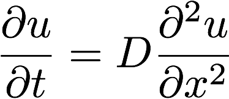
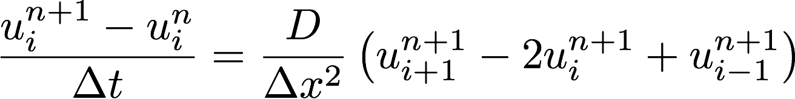
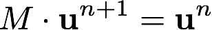
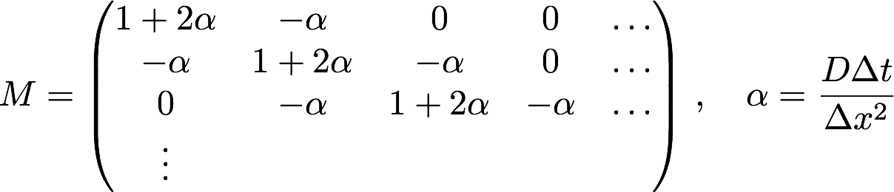

# Lab 11
### The Diffusion equation

In this lab we consider the diffusion equation

where *D* is a positive constant.

In the lecture we derived the implicit algorithm

which may be written as a system of linear equations

where the coefficient matrix *M* is given by

In the given source code implement the function **step()** that solves this system of linear equations in each time step.

Note that the matrix is tri-diagonal and that it is sufficient to store the entries on the three diagonals in vectors.
